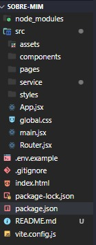

## Apresentação

### Quem é a Maduh? 

 

[Maria Eduarda](https://www.instagram.com/_maduhb/), 

Tenho 23 anos, sou sagitariana e moro em Recife. 
Sou uma ex-estudante de nutrição migrando para a área de tecnologia e resolvi dedicar o ano de 2023 para estudar e aprimorar meus conhecimentos nessa nova área. 

## Conhecendo o projeto "Sobre Mim" 

### 🧠 Contexto

Pensei em criar um website com o propósito de reunir informações abrangentes sobre mim e que ao mesmo tempo mostrasse uma boa parte das coisas que aprendi no bootcamp de Front-End da Reprograma. O foco desse portal será fornecer algumas informações sobre a minha vida acadêmica e profissional, e também, de algumas curiosidades sobre minha vida pessoal. Além disso, irá disponibilizar um portfólio com meus projetos do GitHub e uma página para entrar em contato comigo, se assim desejar. 

### O site conterá 3 páginas:

* Home

* Portfólio

* Contato

### Todas as páginas terão os componentes:

* Menu

* Header 

* Footer

## Estrutura do projeto

 

 

##  `Tecnologias que utilizei` 

| Ferramenta | Descrição |

| `ReactJS` | Framework web |

| `Vite` | Gerador de projeto de front-end |

| `npm` | Gerenciador de pacotes |

| `Firebase` | Ferramenta realtime database para gravar as mensagens de contato |

| `Module CSS` | Ferramenta para ter mais produtividade ao estilizar a aplicação |

| `React router dom` | Dependência para criar rotas no reactjs |

| `React Slick` | Biblioteca utilizada para criar carrosséis |

| `Phosphor` | Dependência com ícones super legais  |

| `Netlify` | Hospedagem para a aplicação |

| `Github` | Hospedagem do código fonte integrado com gerenciador de versionamento |

 

###  `Como rodar o projeto localmente` 

Siga os passos e inclua as informações abaixo:

|&nbsp;&nbsp;&nbsp;&nbsp; Passo &nbsp;&nbsp;&nbsp;&nbsp;&nbsp;| &nbsp;&nbsp;&nbsp;Comando/informação &nbsp;&nbsp;&nbsp;|

| Faça o fork | `botão de forkar` |

| Faça o clone | `git clone` |

| Instale as dependências após acessar a pasta projeto | `npm i` |

| Crie as variáveis de ambiente para integrar com Firebase e inclua os valores da sua conta | `conforme .env.example e lista abaixo`|

| Rode o projeto | `npm run dev` |

**Variáveis de ambiente**

* VITE_API_KEY=

* VITE_AUTH_DOMAIN=

* VITE_PROJECT_ID=

* VITE_STORAGE_BUCKET=

* VITE_MESSAGING_SENDER_ID=

* VITE_APP_ID=

* VITE_DATABASE_URL=

 

## 😎 Próximos passos mapeados

- Ajustar a responsividade da página 'Portfólio'

#### Onde me encontrar

-  [E-mail](maria.eferreira99@gmail.com) 

-  [LinkedIn](https://www.linkedin.com/in/maria-eduarda-ferreira-aab205270/) 

-  [GitHub](https://github.com/Maria-ef) 